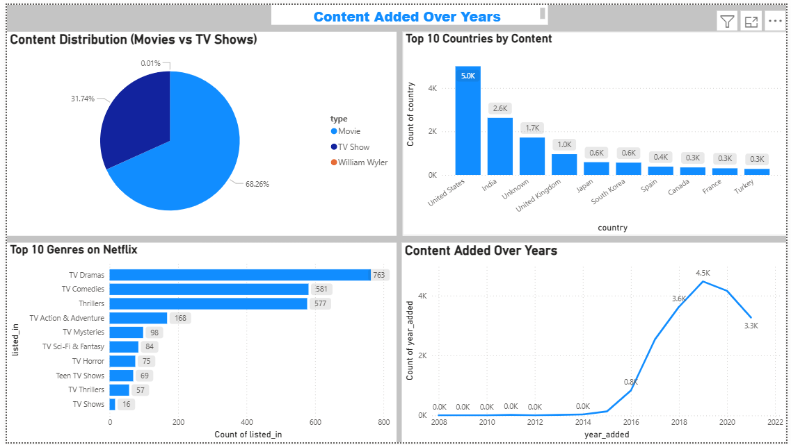
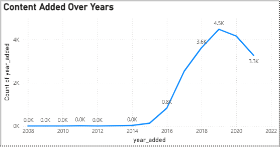
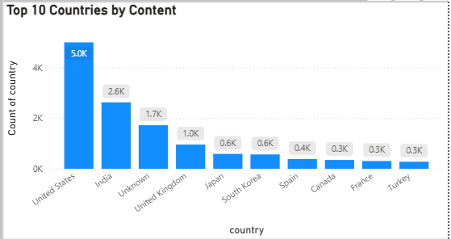
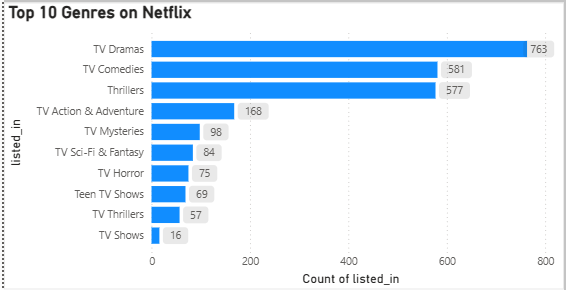
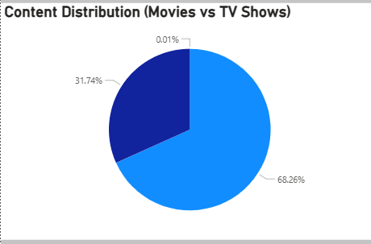

# Netflix Data Pipeline Project

## Overview
Built an end-to-end data pipeline using Python, SQL, and Power BI.

## Steps
- Cleaned raw dataset using pandas
- Loaded data into PostgreSQL
- Performed SQL analysis
- Built interactive dashboard in Power BI

## Tools Used
Python, Pandas, PostgreSQL, Power BI

## 📊 Dashboard Preview

## 📈 Over the Year Trend

## 🌍 Top Countries

## 🎭 Genre Distribution

## 🍿 Movies vs TV Shows

## Key Insights
- Majority content are Movies
- USA has highest content
- Drama is most common genre
- Content increased rapidly after 2015